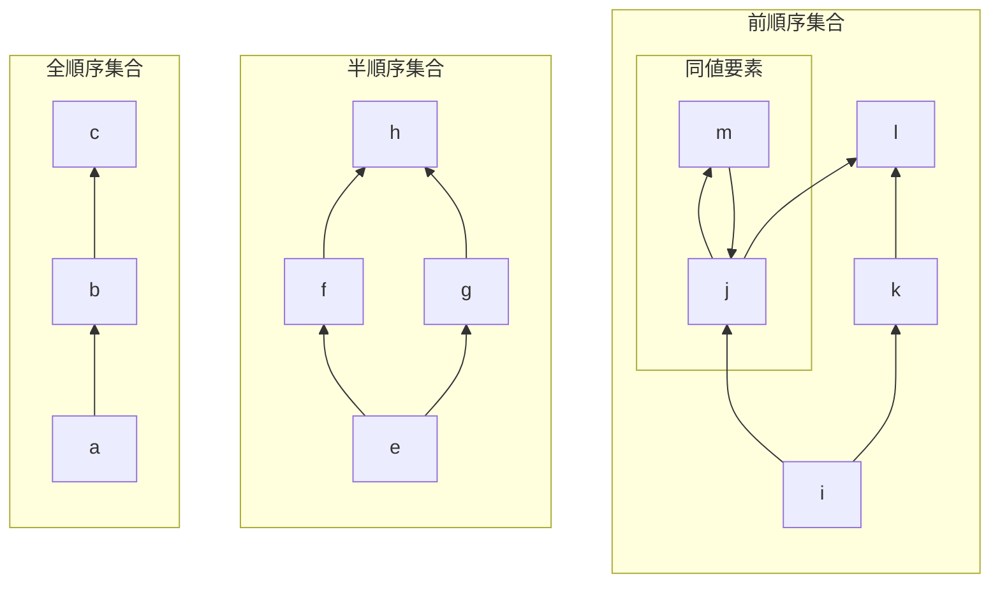
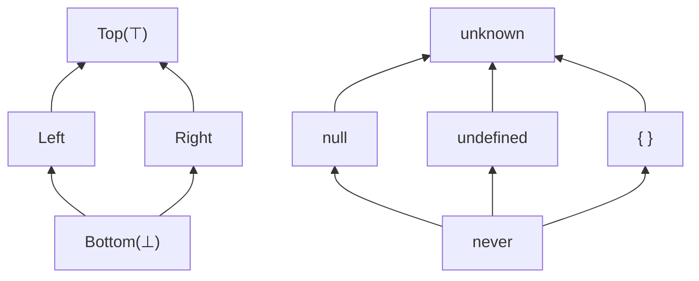
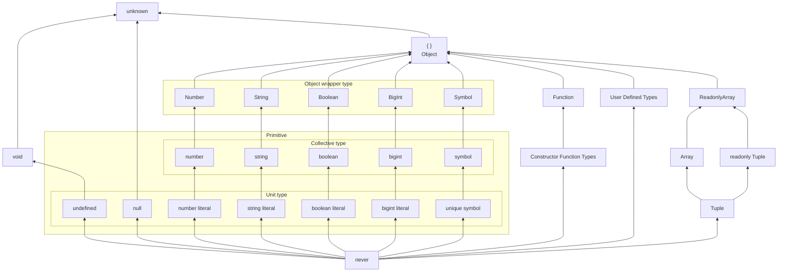
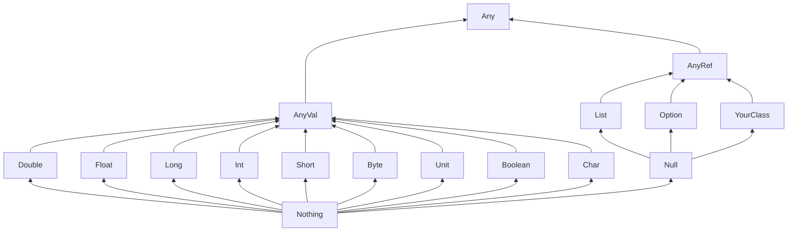
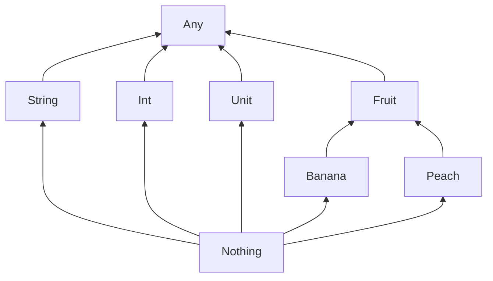
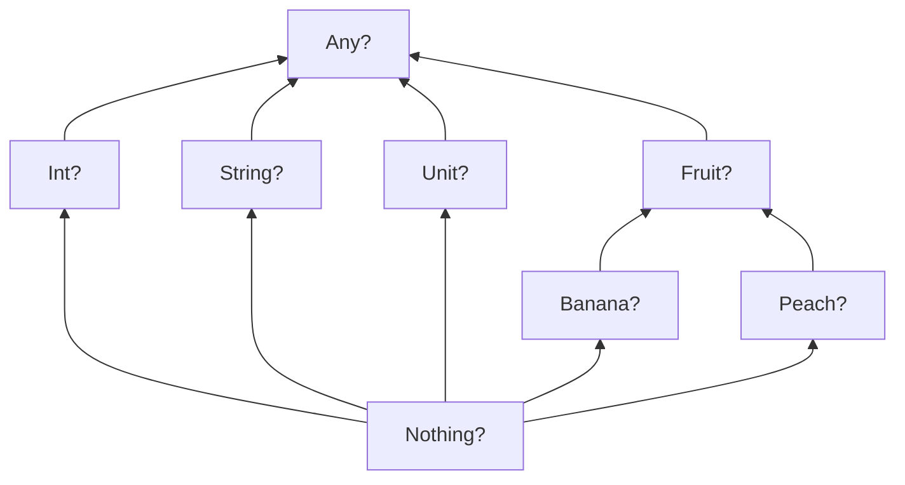
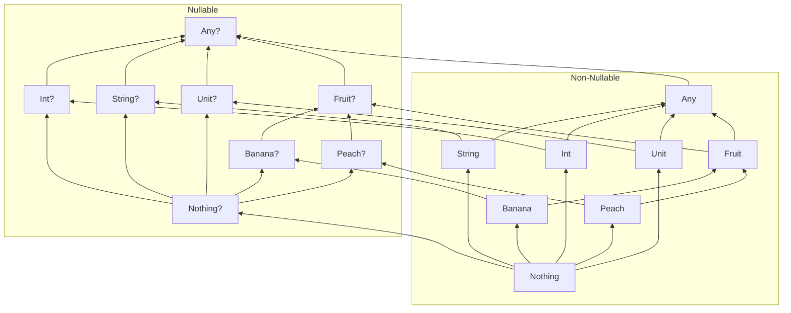
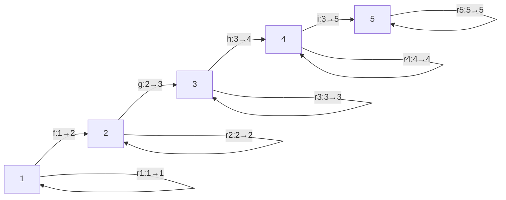
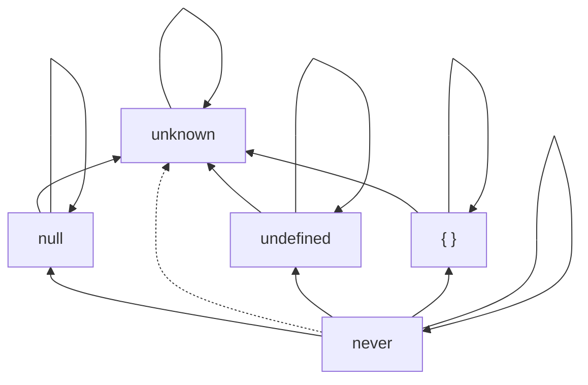

<!-- カバーページ -->

---
src: ./pages/intro.md
done: true
---

<!-- イントロページ -->

---
title: 注意事項
layout: two-cols-mine
---

::left::

## ⚠️ 注意事項

発表においていくつかのお断りがあります

- 発表者は数学の専門家ではありません
- 数学に強い人の協力を求めています(特に証明)
- 現在調査中の内容が含まれます
- 数学的知識が気になる場合には次にあげる記事などを参照してください
- 内容についての質問や議論については以下のZenn本のスクラップやリポジトリまでお願いします

👉 https://zenn.dev/estra/scraps/9a557cab6e6bd0

::right::

## 📚 事前に執筆した記事等

この発表に至るまでの内容や文脈については以下の記事をお読み下さい

<div class="text-base">

- 『**TypeScript における型の集合性と階層性**』
  https://zenn.dev/estra/articles/typescript-type-set-hierarchy
- 『**TypeScript の Narrowing**』
  https://zenn.dev/estra/articles/typescript-narrowing#exausitveness-check
- 『**型のメンタルモデル**』 - サバイバルTypeScript
  https://typescriptbook.jp/reference/values-types-variables/mental-model-of-types
- 『**TypeScriptの代数的部分型模型**』
  https://zenn.dev/estra/books/algebraic-subtyping-models

</div>

---
title: 目次
done: true
---

# 目次

<br>
<Toc maxDepth=1 columns=3 />

<!--
深さ1までしか表示していないので注意する
-->

---
title: 型の同じさについて
layout: section
---

# 型の同じさについて

<v-click>

とある日、次のようなツイートが流れてきました...

</v-click>

---
title: とある日のツイート
layout: two-cols-mine
hideInToc: true
---

::left::

<Tweet id="1774789570598735974" scale="1" cards="hidden" class="mb-0" />
<!-- https://x.com/uhyo_/status/1774789570598735974 -->

<v-click>

> 今回公開された新機能はArranged Field Definition (AFD) と題されています。ここでのarrangedという単語は、「順序に意味がある」という意味に解するのがよいでしょう。つまり、オブジェクト型のフィールド定義において順序まで考慮されるということです。
> 
> [【2024年4月1日のTypeScriptニュース】次期バージョンでオブジェクト型に追加される新機能の紹介](https://qiita.com/uhyo/items/787a475bb618811d3771?utm_campaign=post_article&utm_medium=twitter&utm_source=twitter_share) より引用

</v-click>

::right::

<v-click>

プロパティ順序が異なるオブジェクト型同士を別物として扱うようにする機能が導入されるという内容

```ts
// プロパティ順番が考慮されない型
interface UnOrdered {
  x: number;
  y: number;
  z: number;
}
// プロパティ順番が考慮される型
interface Ordered {
  y: number; // 1番目のプロパティ
  x: number; // 2番目のプロパティ
  z: number; // 3番目のプロパティ
} in that order;

declare function check(x: Orderd): void;

check({ y: 0, x: 0, z: 0 }); // => OK
//      ^1    ^2    ^3
check({ x: 0, y: 0, z: 0 }); // => 型エラー
//      ^2    ^1    ^3
```

※ 記事よりコードを一部改変して記載

</v-click>

<!--
この記事によると、プロパティの順番によらないオブジェクトの型を、プロパティの順番を考慮して別の型として扱えるようになるという
 -->

---
layout: two-cols-mine
hideInToc: true
---

# ツイートに対しての自分の反応は...

::left::

<Tweet v-click id="1774809233080602887" scale="0.9" cards="hidden" />
<!-- https://x.com/pd1xx/status/1774809233080602887 -->

::right::

<v-clicks>

<br>

そういえば、
新しくの追加された機能の名前は?


=> "**A**rranged **F**ield **D**efinition"

=> "**AFD**"

=> "**A**pril **F**ools' **D**ay"

<div class="px-auto mt-25 text-center">
<p class="text-3xl">

**騙された**😭

</p>
</div>

<br>

４月バカ...

</v-clicks>

---
layout: two-cols-mine
hideInToc: true
---

::left::

## ちょっと待てよ

<v-clicks>

確かに記事内にはおかしな点は複数あったが、
機能としてはそこまで不自然ではないと感じた

<div>

例えば、以下の２つの型は同じものとして扱うべきなのか?

```ts twoslash
interface T1 {
  x: number;
  y: number;
  z: number;
}
interface T2 {
  y: number;
  z: number;
  x: number;
}
```

</div>

上記二つの型は同じ型として扱われる ($T1 = T2$)  
名前は異なるが構造が同じ二つの型には互換性がある

→ TypeScriptでは型の名前ではなく、**構造**が重要

</v-clicks>

::right::

<v-clicks>

<div>

## 型システムによる互換性の違い

<div class="border-2 rounded-md pl-3 py-2 mt-2">

- 名前の違いによる互換性の違い → **名前的型付け**
- 構造の違いによる互換性の違い → **構造的型付け**

</div>
</div>

<div>

次の二つの型はどうか?

```ts twoslash
interface T1 { x: number; y: number; z: number; }

interface T3 { x: number; y: number; }

declare function check(o: T3): void;

check({ x: 0, y: 0 }); // => OK

const obj: T1 = { x: 0, y: 0, z: 0 };
check(obj); // => OK
```

</div>

上記二つの型は同じ型としては扱われないが、  
**部分型関係**(=型の互換性)がある ($T1 <: T3$)

→ 名前ではなく**構造**を元に部分型関係が成り立つ

</v-clicks>

---
layout: two-cols-mine
title: 部分型関係
---

::left::

### 部分型関係とは

<v-clicks>

<div class="border-2 rounded px-3 mt-2 mb-4">

部分型関係とは、ある型 $S$ の項が別の型 $T$ の項が期待されている文脈で安全に使用可能であるということを定める関係性のことで、$S <: T$ と表記して「型 $S$ は型 $T$ の部分型である」と読み、逆に「型 $T$ は型 $S$ の上位型である」とも読める

</div>

```ts twoslash
type A = { fst: number; }; // より一般的
type B = { fst: number; snd: string; }; // より具体的

// A型が期待される文脈でB型の項を割り当てることができる
const b1: B = { fst: 42, snd: "st", };
const a1: A = b1;
//    ^^

// その逆はできない(安全に置換できない)
const a2: A = { fst: 42, };
const b2: B = a2;
//    ^^
```

</v-clicks>

::right::

<v-clicks>

オブジェクト型の場合には、制約条件(プロパティの数)が多い型 $B$ の方がより具体的な型であり、制約条件が少ない型 $A$ の方がより一般的な型であり、$B <: A$ が成り立つ

<div>

```ts twoslash
type A = number; // より一般的
type B = 42; // より具体的

// A型が期待される文脈でB型の項を割り当てることができる
const b1: B = 42;
const a1: A = b1;
//    ^^

// その逆はできない(安全に置換できない)
const a2: A = 42;
const b2: B = a2;
//    ^^
```

リテラル型とプリミティブ型の場合には、リテラル型の方がより詳細な型であり、プリミティブ型の方がより一般的な型なので、リテラル型はプリミティブ型の部分型であるため、$B <: A$ が成り立つ

</div>

</v-clicks>

---
title: プロパティ順序の異なる二つの型
hideInToc: true
layout: two-cols-mine
---


::left::

<v-clicks>

<div>

### プロパティ順序の異なる二つの型

<br>

```ts twoslash
// プロパティ順序が異なる以外は構造が同じ型同士
interface T1 { x: number; y: number; z: number; }
interface T2 { y: number; z: number; x: number; }

const t1: T1 = { x: 0, y: 0, z: 0 };
const t2: T2 = { y: 0, z: 0, x: 0 };

// 相互に割り当てることができるため相互に部分型
let t1_2: T1 = t2;
let t2_2: T2 = t1;
```

</div>

この場合、$T1 <: T2$ かつ $T2 <: T1$ が成り立つわけだが、この事実から二つの型が同じ型 ($T1 = T2$) であるということが言えるのか?

暗黙的に型同士の等しさを $T1 = T2$ のように等号で表していたが、上のコードからは、二つの型が相互に部分型関係 ($T1 <: T2$ かつ $T2 <: T2$) にあるということのみが分かる

</v-clicks>

::right::

<v-clicks>
<div>

### `Object` 型と `{}` 型

<br>

```ts twoslash
// 二つのオブジェクトの型
type O1 = Object;
type O2 = {};

declare const o1: O1;
declare const o2: O2;

// 相互に割り当てることができるため相互に部分型
const o1_2: O1 = o2;
const o2_2: O2 = o1;
```

</div>

`Object` 型と `{}` 型は相互に割り当て可能で部分型関係にあるが、この二つの型は同じ型($\text{Object} = \{\}$)といえるか?

答えは**No**です

そもそも同じ型、ひいては「型の同じさ」とは何か?
そして、型同士の同じさをどのように判定できるか?

</v-clicks>

---
hideInToc: true
layout: quote
title: 型の同じさの概念はそれほど自明ではない
---

なにが言いたいかというと...

<v-clicks>

# 型の"同じさ"の概念はそれほど自明ではない

</v-clicks>

---
title: 型の同値性
layout: two-cols-mine
---

::left::

## 型の同一性

<v-clicks>

型の同じさを示す指標として「同一性 (**identity**)」という概念があり、この発表では $T1 = T2$ という表現を用いて表現します

<div>

```ts twoslash
// Equals、Idential などの名前で用いられる同一性の判定ハック
type IsIdentical<Fst, Snd> =
  (<T>() => T extends Fst ? 1 : 2) extends
  (<T>() => T extends Snd ? 1 : 2)
    ? true
    : false;

type I1 = IsIdentical<number, number>; // => true
type I2 = IsIdentical<Object, {}>; // => false
type I3 = IsIdentical<
  { x: number; y: number; z: number; },
  { y: number; z: number; x: number; }
>; // => true
```

<p class="break-all text-sm">

https://github.com/microsoft/TypeScript/issues/27024#issuecomment-421529650

</p>
</div>

</v-clicks>

::right::

<div v-click class="text-xs border-2 px-4 py-0 rounded-md">

Two types are considered ***identical*** when

* they are both the Any type,
* they are the same primitive type,
* they are the same type parameter,
* they are union types with identical sets of constituent types, or
* they are intersection types with identical sets of constituent types, or
* they are object types with identical sets of members.

Two members are considered identical when

* they are public properties with identical names, optionality, and types,
* they are private or protected properties originating in the same declaration and having identical types,
* they are identical call signatures,
* they are identical construct signatures, or
* they are index signatures of identical kind with identical types.

[TypeScript Language Specification](https://github.com/microsoft/TypeScript/blob/3c99d50da5a579d9fa92d02664b1b66d4ff55944/doc/spec-ARCHIVED.md#L2225-L2261) より引用

</div>

<!--
型の同じさを示す指標として「同一性 (**identity**)」という概念があります
公式ドキュメントには記載されていませんが古い仕様書には記載されている概念です

Type Challenge においては、型の等しさを判定するために Equals という名前の型ヘルパーとして提供されています
 -->

---
title: 型の同値関係
layout: two-cols-mine
---

::left::

## 型の同値関係

<v-clicks>

型の同じさを示す指標として「同値関係 (**equivalence**)」という概念があり、この発表では $T1 ≡ T2$ という表現を用いて表現します

```ts twoslash
// 割当互換性(≒ 部分型互換性)の判定
type IsAssignable<Fst, Snd> = [Fst] extends [Snd]
  ? true : false;
// 同値関係(相互に部分型であるか)の判定
type IsEquivalent<Fst, Snd> =
  IsAssignable<Fst, Snd> extends true
    ? IsAssignable<Snd, Fst> extends true
      ? true : false
    : false;

type E1 = IsEquivalent<number, number>; // => true
type E2 = IsEquivalent<Object, {}>; // => true
type E3 = IsEquivalent<{ x: number; y: number; z: number; }, { y: number; z: number; x: number; }>; // => true
```

型の同値関係は同一性よりも**緩い等しさ**を示す概念であり、相互に部分型関係があるならば同値関係にあるといえます ($\text{同一性} \subset \text{同値関係}$)

</v-clicks>

::right::

<v-clicks>

## 他言語での同値関係

同値関係は他言語であれば仕様書に記載されている概念です

<div>

#### Kotlin

> Two types $A$ and $B$ are equivalent ($A \equiv B$), iff $A <: B \land B <: A$.

https://kotlinlang.org/spec/type-system.html?paragraph=,subtyping,3#subtyping-rules

</div>

<div>

#### Scala

> Equivalence is defined as mutual conformance.
> $S =:= T$ if and only if both $S <: T$ and $T <: S$

https://www.scala-lang.org/files/archive/spec/3.4/03-types.html#equivalence

</div>
</v-clicks>

---
title: 型の関係性チェッカー
layout: two-cols-mine
---

::left::

### 型の関係性チェッカー

<v-clicks>

これまでの話をまとめると、型同士の関係性をチェックするための以下のような型ヘルパーを作成できます

```ts twoslash
type IsIdentical<Fst, Snd> =
  (<T>() => T extends Fst ? 1 : 2) extends
  (<T>() => T extends Snd ? 1 : 2)
    ? true
    : false;
type IsAssignable<Fst, Snd> = [Fst] extends [Snd]
  ? true : false;
type IsEquivalent<Fst, Snd> = IsAssignable<Fst, Snd> extends true
  ? IsAssignable<Snd, Fst> extends true
    ? true
    : false
  : false;
// ---cut-before---
type Compat<Fst, Snd> =
  IsEquivalent<Fst, Snd> extends true
    ? "Equivalent"     // Fst ≡ Snd
      : IsAssignable<Fst, Snd> extends true
      ? "Subtype"      // Fst <: Snd
        : IsAssignable<Snd, Fst> extends true
        ? "Supertype"  // Fst :> Snd
    : "Unrelated";     // Fst ⊥ Snd
// 型同士の関係チェッカー
type Relation<Fst, Snd = Fst> =
  IsIdentical<Fst, Snd> extends true
    ? "Identical"
    : Compat<Fst, Snd>;

type R1 = Relation<Object, {}>; // => "Equivalent"
type R2 = Relation<{ x: number; y: number; z: number; }, { y: number; z: number; x: number; }>; // => "Identical"
type R3 = Relation<{ x: number; }, { x: number; y: number; }>; // => "Subtype"
type R4 = Relation<1, 2>; // => "Unrelated"
type R5 = Relation<number, 42>; // => "Supertype"
```

</v-clicks>

::right::

<v-clicks>
<div>

### JSR で公開中

<div>
  
</div>
</div>

<div>

https://jsr.io/@yo-goto/type-relation

```sh
# deno
deno add @yo-goto/type-relation
# npm
npx jsr add @yo-goto/type-relation
```

利用時には以下のように使うことができます

```ts
import { Relation } from "@yo-goto/type-relation";

type _0 = Relation<number, string | number>; // => "Subtype"
type _1 = Relation<string | number, number>; // => "Supertype"
```

</div>
</v-clicks>

<!--
**JSR** (JavaScript Registory) とは、JavaScirpt と TypeScript のためのオープンソースのパッケージレジストリ
-->

---
title: 型とは
layout: statement
---

ここで一段落...

<v-clicks>

## そもそも型って一体何なんだろう?

</v-clicks>

---

# 型の役割

型は〇〇と見なせる

<br>
<v-clicks>

- Type as **Classification** : 値の分類としての型
  - 最も一般的な解釈
- Type as **Data size** : データサイズとしての型
  - `int`, `float`, `double` などメモリ領域のサイズを定める
- Type as **Bits** : ビット表現としての型
  - ビット列に対して文字列なのか数値なのかといった解釈方法を定める情報レイヤ
- Type as **Proposition** : 命題としての型
  - プログラムを証明に対応させるときの命題
- Type as **Sets** : <span v-mark.circle.orange="6">集合としての型</span>
  - 値の集合として解釈できる数学的な対象

</v-clicks>

---
layout: center
hideInToc: true
---

# "set of values and the things you can do with them"

型とは値とそれらを使ってできること(演算)の集合である

<br>


---
title: 型のメンタルモデル
layout: center
---

# 公式ドキュメントでも推奨される型のメンタルモデル
公式ドキュメントの "Types as Sets" の項目に注目

<div>


</div>

👉 https://www.typescriptlang.org/docs/handbook/typescript-in-5-minutes-oop.html#types-as-sets

<!--
集合は型の最もシンプルなメンタルモデル
 -->

---
layout: section
title: 集合論
---

# 集合論

---
title: 集合としての型
---

# 型が集合ってどういうこと?
とりあえずは単に型を「値の集合」として捉えてみる

<div class="flex justify-between">
<v-click>
<div>
  <figure>
    
    <figcaption class="text-center">型は値の集まり(集合)</figcaption>
  </figure>
</div>
</v-click>
<v-click>
<figure>
  
  <figcaption class="text-center">和集合と共通部分</figcaption>
</figure>
</v-click>
</div>

---
layout: two-cols-mine
---


::left::

# 集合演算

型の演算は集合の演算と対応する

<v-clicks>

- ユニオン型 → 和集合 → 論理和
- インターセクション型 → 共通部分 → 論理積

</v-clicks>
<br>

<v-click>
<div>
  
</div>
</v-click>

::right::

<v-click>

```ts twoslash
type A = { a: "st" };
type B = { b: 42 };
 
type Union = A | B;        // AとBの和集合を表現する型
type Intersection = A & B; // AとBの共通部分を表現する型

const u1: Union = { a: "st" };
const u2: Union = { b: 42 };
const u3: Union = { a: "st", b: 42 };
const i1: Intersection = { a: "st", b: 42 };
```

</v-click>

<v-click>

<div>
  
</div>
</v-click>

---
title: 否定型
layout: two-cols-mine
---

::left::

# 否定型
集合演算は和集合や共通部分だけではない!

<v-clicks>

もしも指定した値やその集合以外の型を表現するような**否定型**(negated type)があれば、**補集合**を表現でき、ド・モルガンの法則が利用できるようになる。

<div>
<figure>
  

</figure>
<figcaption class="text-sm text-center -mt-3">

https://github.com/microsoft/TypeScript/issues/4196

</figcaption>
</div>
</v-clicks>

::right::

<v-click>

<div>
  
</div>

```ts
type X = { x: "st" };
type Y = { y: 42 };
type Z = { z: true };

// 否定型を ! として表現
type Red = X & !(Y | Z);
type Blue = Y & !(X | Z);
type Green = Z & !(X | Y);
```

</v-click>

---
layout: two-cols-mine
title: 型の代数
---

::left::

## 型の代数

<v-clicks>

型の集合は加法(和)と乗法(積)に相当する演算を持つ

```ts twoslash
type A = { a: "st" };
type B = { b: 42 };
type A_plus_B = A | B;  // 型の和
type A_times_B = A & B; // 型の積
```

そして、それぞれの演算について単位元を持つ

- 和の単位元 $0$ : `never`
- 積の単位元 $1$ : `unknown`

```ts twoslash
type A = { a: "st" };
type B = { b: 42 };
// ---cut-before---
type Zero = never;
type One = unknown;

type A_plus_Zero = A | Zero | Zero | Zero;
//                 A +  0   +  0   +  0 = A
type A_times_One = A & One & One & One;
//                 A *  1  *  1  *  1 = A
```

</v-clicks>

::right::

<v-clicks>

<div>

## 半環構造

以下の代数法則を満たす加法演算と乗法演算を持つ集合 $R$ は「**半環** (semi-ring)」という代数的構造をなす

</div>

<div class="text-xs">

法則名 | 恒等式
--|--
演算の閉性 (closure) | $a + b \in R$ <br/> $a * b \in R$
結合律 (associativity) | $a + (b + c) = (a + b) + c$ <br/> $a * (b * c) = (a * b) * c$
吸収元 (annihilating element) | $a * 0 = 0 = 0 * a$
単位元 (identity element) | $a + 0 = a$ (加法単位元) <br/> $a * 1 = a$ (乗法単位元)
分配律 (distributivity) | (乗法が加法上に分配的) <br/> $a * (b + c) = (a * b) + (a * c)$ <br/> $(b + c) * a = (b * a) + (c * a)$

</div>
</v-clicks>

---
layout: two-cols-mine
title: 代数検証
---

::left::

## 代数検証

実際に TypeScript で代数法則を検証してみる

<div v-click class="text-xs">

- 結合律 (associative law)
  - $A\ |\ (B\ |\ C) \equiv (A\ |\ B)\ |\ C$
  - $A\ \&\ (B\ \&\ C) \equiv (A\ \&\ B)\ \&\ C$
- 単位元 (identity element) の存在性
  - $A\ |\ \text{never} \equiv A$ (加法単位元)
  - $A\ \&\ \text{unknown} \equiv A$ (乗法単位元)
- 吸収元 (annihilating element) の存在性
  - $A\ \&\ \text{never} \equiv \text{never} \equiv \text{never}\ \&\ A$
- 分配律 (distributive law): (乗法が加法上に分配的)
  - $A\ \&\ (B\ |\ C) \equiv (A\ \&\ B)\ |\ (B\ \&\ C)$
  - $(A\ |\ B)\ \&\ C \equiv (A\ \&\ C)\ |\ (B\ \&\ C)$

<hr>

- 冪等律 (idempotent law)
  - $A\ |\ A \equiv A$
  - $A\ \&\ A \equiv A$
- 可換律 (commutative law)
  - $A\ |\ B \equiv B\ |\ A$
  - $A\ \&\ B \equiv B\ \&\ A$

</div>

::right::

<v-clicks>

等しさのクラスは同一性($=$)と同値関係($\equiv$)で検証する

```ts twoslash
type IsIdentical<Fst, Snd> =
  (<T>() => T extends Fst ? 1 : 2) extends
  (<T>() => T extends Snd ? 1 : 2)
    ? true
    : false;
type IsAssignable<Fst, Snd> = [Fst] extends [Snd]
  ? true : false;
type IsEquivalent<Fst, Snd> = IsAssignable<Fst, Snd> extends true
  ? IsAssignable<Snd, Fst> extends true
    ? true
    : false
  : false;
type Compat<Fst, Snd> =
  IsEquivalent<Fst, Snd> extends true
    ? "Equivalent"     // Fst ≡ Snd
      : IsAssignable<Fst, Snd> extends true
      ? "Subtype"      // Fst <: Snd
        : IsAssignable<Snd, Fst> extends true
        ? "Supertype"  // Fst :> Snd
    : "Unrelated";     // Fst ⊥ Snd
// 型同士の関係チェッカー
type Relation<Fst, Snd = Fst> =
  IsIdentical<Fst, Snd> extends true
    ? "Identical"
    : Compat<Fst, Snd>;
// ---cut-before---
type A = { fst: number }; type B = { snd: string }; type C = { trd: boolean };

// 結合律
type A1 = Relation<A | (B | C), (A | B) | C>; // => "Identical"
type A2 = Relation<A & (B & C), (A & B) & C>; // => "Identical"
type A3 = Relation<A | B | C, C | A | B> // => "Identical"
// 単位元の存在性(0: never, 1: unknown)
type R1 = Relation<A, A | never>; // => "Identical"
type R2 = Relation<A, A & unknown>; // => "Identical"
// 吸収律
type H1 = Relation<A | (A & B), A>; // => "Equivalent"
type H2 = Relation<A & (A | B), A>; // => "Equivalent"
// 冪等律
type I1 = Relation<A | A, A>; // => "Identical"
type I2 = Relation<A & A, A>; // => "Identical"
// 分配律
type D1 = Relation<A & (B | C), (A & B) | (A & C)>; // => "Identical"
type D2 = Relation<(A | B) & C, (A & C) | (B & C)>; // => "Identical"
// 可換律
type C1 = Relation<A | B, B | A>; // => "Identical"
type C2 = Relation<A & B, B & A>; // => "Identical"
```

</v-clicks>

---
title: 必要な数学理論
---

# 型模型のための数学理論

部分型関係がなす代数的構造には  
以下のような数学領域が関わっている

<v-clicks>

- 論理学 ([logic](https://en.wikipedia.org/wiki/Logic))
- 集合論 ([set theory](https://en.wikipedia.org/wiki/Set_theory))
- 順序理論 ([order theory](https://en.wikipedia.org/wiki/Order_theory))
- 束論 ([lattice theory](https://en.wikipedia.org/wiki/Lattice_(order)))
- 環論 ([ring theory](https://en.wikipedia.org/wiki/Ring_theory))
- 圏論 ([category theory](https://en.wikipedia.org/wiki/Category_theory))

</v-clicks>

---
layout: two-cols-mine
---

# 代数法則と代数的構造
集合上に定まった演算によって決まる構造

::left::

<v-clicks>

### 代数的構造とは

**代数的構造** ([algebraic structure](https://en.wikipedia.org/wiki/Algebraic_structure)) とは、集合上に定まった演算により決まる構造のことであり、形式的には元となる集合 (**台集合**と言う) $S$ とその集合上に定まった演算 $*$ の組 $(S, *)$ のことを言う

</v-clicks>

<v-click>

代数的というからにはその構造が持つ演算はなんらかの代数法則 (**algebraic laws**) を満たしており、代数法則は以下のような恒等式 ([identity](https://en.wikipedia.org/wiki/Identity_(mathematics))) などによって表現されます。

$$
(a + b) + c = a + (b + c) \quad \forall a,b,c \in S
$$

</v-click>

::right::

<v-click>

### 代表的な代数的構造

</v-click>

<v-clicks>

- マグマ (magma)
  - 一つの二項演算を備えた構造
- **環** (ring)
  - 加法・乗法を備えた構造
- 体 (field)
  - 加法・減法・乗法・除法を備えた構造
  - 実数など
- その他
  - モノイド (monoid)
  - 群 (group)

</v-clicks>

---
layout: two-cols-mine
title: 改めて部分型関係
hideInToc: true
---

# 包含関係として部分型関係

部分型関係の本質は順序関係にある

::left::

<v-click>

### 部分型付け規則

部分型関係は以下のような部分型付け規則(subtyping rule)に支配されている

</v-click>
<v-click>

$$
\begin{alignat}{2}
&\text{反射律} \quad S <: S \\
&\text{推移律} \quad
\frac
{S <: U \quad U <: T}
{S <: T}
\end{alignat}
$$

</v-click>

反射律は、自己言及的な関係であり、任意の型 $S$ に対して $S$ は自身の部分型であるということを示す

推移律は、部分型関係が推移的であること、つまり $A <: B$ かつ $B <: C$ なら $A <: C$ であり、$A$ は $B$ を介して $C$ の部分型であることが推移的に分かる

::right::

<v-click>

### 部分型関係の集合論的解釈

</v-click>

<v-click>

集合の包含関係は反射律と推移律を満たしており、部分型関係は集合論的に解釈すると包含関係とみなせる


</v-click>

<!--
### 部分型関係とは

部分型関係とは、ある型 $S$ の項が別の型 $T$ の項が期待されている文脈で安全に使用可能であるということを定める関係性のこと。部分型関係は $S <: T$ と表記して、型 $S$ は型 $T$ の部分型であると読む。
-->

---
layout: two-cols-mine
---


# 部分型関係がなす代数的構造
部分型関係はいくつかの代数的構造を作る

::left::

<v-clicks>

### 部分型関係が満たす代数法則

部分型による順序関係($\prec$)は以下の代数法則を満たす

- **反射律** (reflexive law)
  - $a \prec a \ (\forall a \in S)$
- **推移律** (transitive law)
  - $a \prec b \land b \prec c \Rightarrow a \prec c \ (\forall a, b, c \in S)$
- **反対称律** (asymmetric law)
  - $a \prec b \land b \prec a \Rightarrow a = b \ (\forall a, b \in S)$

</v-clicks>

::right::

<v-clicks>

### 半順序集合

順序関係を持つ集合は一般に順序集合と呼ばれ、いくつかの種類がある。
この三つの代数法則を満たす集合は半順序集合(pre-order set)と呼ばれる



</v-clicks>

---
layout: two-cols-mine
---

# 束構造
特殊な半順序集合

::left::

<v-click>

### 束とは

集合内の任意の二元部分集合が一意な最小上界と最大下界を持つような半順序集合は束(lattice)と呼ばれる特殊な構造を作ります

</v-click>

<v-click>



<p class="text-right">

※ `"strictNullChecks": true`

</p>

</v-click>

::right::

<v-clicks>

### 部分型束

部分型関係が定める束構造を **Subtype lattice** (部分型束)と呼びます

<div>
<div>
  
</div>

<div class="text-sm -mt-2">

https://typescriptbook.jp/reference/values-types-variables/mental-model-of-types

</div>
</div>

</v-clicks>

---

# TypeScriptの部分型束

より具体的な束構造



---
layout: section
title: 他言語の束構造
---

# 他言語の束らしき構造

---

## Scala

<v-click>



</v-click>

---
layout: two-cols-mine
hideInToc: true
---

## Kotlin

Kotlinの

::left::

<v-click>

### Non-nullable

</v-click>

<v-click>



</v-click>

::right::

<v-click>

### Nullable

</v-click>

<v-click>



</v-click>


---
hideInToc: true
---

## Kotlin




---
layout: section
---

# 圏論

多くの予備知識が必要なので省略

---
title: 圏とは
layout: two-cols-mine
---

## 圏とは

::left::

圏とは簡単に言えば複数のモノの集まりとそのモノ同士の関係を表す矢印からなる、ある種のシステムです。

<div class="text-sm">

- 対象の集まり $A, B, C \ldots$ と、その対象間に射の集まり $f, g, h \ldots$ がある
- 任意の射の組 $f: A \rightarrow B,\ g: B \rightarrow C$ の合成射(composition) $f \circ g$ が存在する
- 任意の対象 $A$ に恒等射(identity arrow) $id_A: A \rightarrow A$ が存在する

</div>

任意の射 $f: A \rightarrow B,\ g: B \rightarrow C,\ h: C \rightarrow D$ について以下の「圏の公理」を満たすとき、その構造は圏(category)であると言います。

<div class="text-sm">

- 結合律 (associativity): $h \circ (g \circ f) = (h \circ g) \circ f$
- 単位律 (identity): $f \circ id_A = f = id_B \circ f$

</div>

::right::

<div>
  
</div>

あるシステムを考えるとき、そのシステムがこの圏の公理を満たしてさえいればそれは圏であると言うことができるので、様々なものが圏という構造であるとみなせます (あるいは圏を構築できます)

---
layout: two-cols-mine
---

::left::

## 順序集合の圏

$$
a \le b \Leftrightarrow a \rightarrow b
$$



<div class="-mt-4">
  
</div>

::right::

## 型と部分型関係の圏

対象を型、射(矢印)を部分型関係として捉えると、恒等射は反射律、合成射は部分型関係の推移律によってそれぞれ存在が保証されるので、圏を構築できる



---
title: 調査資料
---

# 気になったので...

<v-click>

調査した内容をまとめてZennで本を作りました

</v-click>

<v-click>


👉  https://zenn.dev/estra/books/algebraic-subtyping-models

</v-click>

---
hideInToc: true
---

# サバイバルTypeScript

型のメンタルモデルの記事を書きました


<br>

👉  https://typescriptbook.jp/reference/values-types-variables/mental-model-of-types

---
src: ./pages/references.md
done: true
---

<!-- 参考文献ページ -->

---
src: ./pages/ad_tapl_event.md
done: true
---

<!-- taplイベントの宣伝ページ -->

---
layout: end
hideInToc: true
done: true
---

# END

ご清聴ありがとうございました

<!--
これでトーク終了
最後はSlidevというツールでこのスライドを作ったことをアピールする
-->
